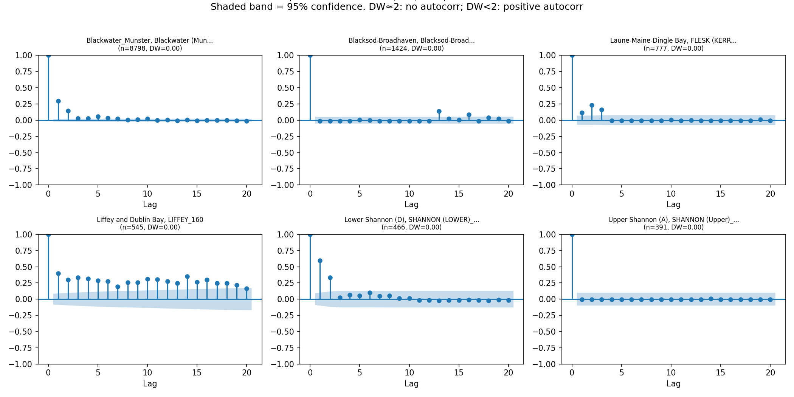
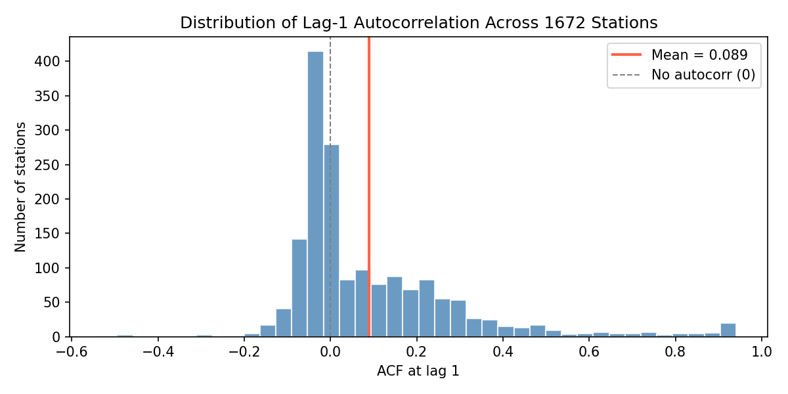
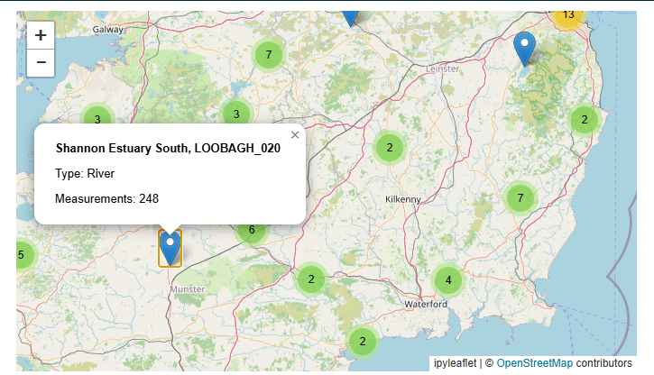
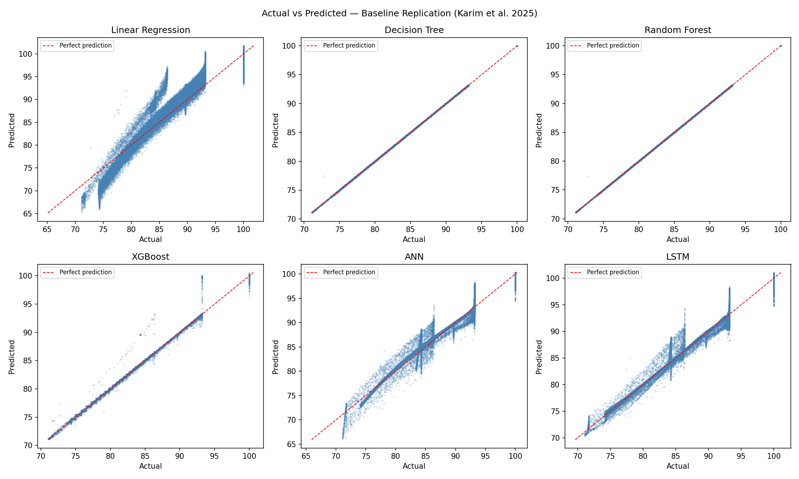
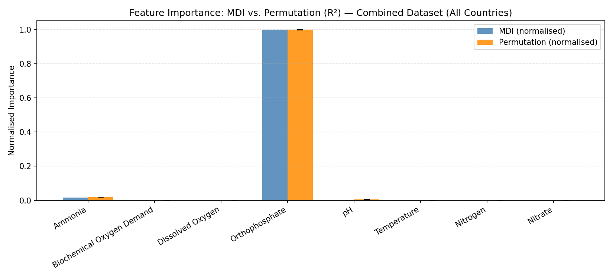
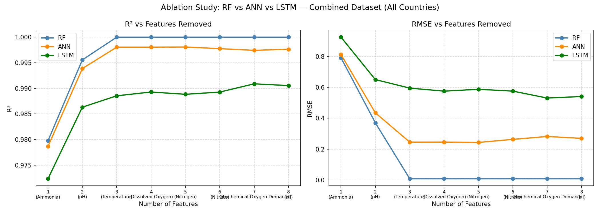

# Water Quality Index Prediction — Multi-Model Ablation Study

Multi-country water quality index (WQI) regression using ANN, LSTM, and Random Forest on CCME WQI data, with a progressive feature ablation study, temporal/spatial autocorrelation analysis, and baseline replication of Karim et al. (2025). [Download Dataset](https://doi.org/10.6084/m9.figshare.27800394)

**Research Question:** How does predictive performance degrade as physicochemical parameters are progressively removed — and which model architecture (ANN, LSTM, RF) is most robust to reduced input information?

---

## Dataset

| Country | Stations | Approx. Rows |
|---------|----------|--------------|
| Ireland | ~9,700   | 235k         |
| England | ~48,600  | 2.1M         |
| USA     | ~955     | 414k         |
| Canada  | ~2,350   | 4k           |
| China   | 1        | 46k          |

**Raw:** 2,827,977 rows

**Features (8):** Ammonia, BOD, Dissolved Oxygen, Orthophosphate, pH, Temperature, Nitrogen, Nitrate
**Target:** `CCME_Values` — continuous WQI score (0–100), regression task

---

## Project Structure

```
AIHWS/
├── config.py                           # Configuration file (i.e dataset selection)
├── main.ipynb                          # Combined dataset: ANN/LSTM/RF ablation study (main experiment)
├── baseline.ipynb                      # Replication of Karim et al. 2025 — 6-model comparison
├── main_ireland.ipynb                  # Ireland-only dataset (legacy, classification version)
├── geocode_map.ipynb                   # Geonames geocoding + ipyleaflet interactive map
├── src/
│   ├── autocorrelation_analysis.ipynb  # Temporal ACF + station-level ICC (Ireland subset)
│   ├── validation_study.ipynb          # Temporal & spatial validation (Moran's I, holdout splits)
│   ├── geocode_bulk.py                 # Bulk Geonames geocoding (2188 stations, resumable)
│   ├── minority_analysis.ipynb         # Minority class investigation (legacy)
│   ├── china_eval.ipynb                # Cross-region evaluation on China
│   └── export_stations.py              # Exports top-150 Ireland stations for geocoding
├── data/
│   └── Dataset/
│       ├── Combined Data/              # Combined_dataset.csv (all 5 countries)
│       └── Country-Wise Data/          # Per-country CSVs
├── output/                             # All generated plots, CSVs, saved models
├── pyproject.toml                      # Dependencies managed via uv
└── uv.lock
```

---

## Notebooks

### `main.ipynb` — Main Experiment
Full pipeline on the combined 5-country dataset:


1. IQR outlier removal -> 70/15/15 split -> StandardScaler (X) + MinMaxScaler (y)
2. ANN regression: `Dense(128)→BN→Dropout → Dense(64)→BN→Dropout → Dense(32)→Dropout → Dense(1)`
3. RF feature importance (MDI + permutation) → feature removal ordering
4. **Ablation study:** ANN, LSTM, and RF retrained for each of 8 feature subsets
5. Combined 3-model comparison plot
6. Data investigation: Spearman correlations, variance by WQI category, proxy failure rates

### `baseline.ipynb` — Karim et al. 2025 Replication
Replicates Table 6 & 7 with Linear Regression, Decision Tree, RF, XGBoost, ANN, LSTM. Results closely match the paper.

### `src/autocorrelation_analysis.ipynb` — Autocorrelation
- **Temporal:** ACF per station + Durbin-Watson; lag-1 mean=0.089, DW≈0.00 for densest stations
- **Spatial proxy:** ICC=0.310 — no lat/lon in dataset, so Moran's I not computable here




### `geocode_map.ipynb` + `src/geocode_bulk.py` — Geospatial
- `geocode_map.ipynb`: geocodes top 150 Ireland stations via Geonames API; interactive ipyleaflet map
- `src/geocode_bulk.py`: bulk geocodes all 2,188 stations with ≥20 measurements; resumes from checkpoint; rate-limited to ~970 req/hour. Result: **1,659 / 2,188 stations geocoded (75.8%)**



### `src/validation_study.ipynb` — Temporal & Spatial Validation
Investigates whether the main experiment's random split produces inflated results by testing two stricter strategies on the Ireland subset.

**Part 1 — Temporal split** (train <2018, test ≥2018, 60k rows):
- Data sorted by `(Area, Date)` — consecutive rows within each station are chronological
- LSTM uses proper per-station sequences (SEQ_LEN=4) rather than single-row reshape

**Part 2 — Spatial split** (15% of geocoded stations held out as test):
- 1,659 geocoded stations used; 229 peripheral stations (furthest from centroid) withheld
- Moran's I computed with inverse-distance weights + 999-iteration permutation test

---

## Key Results

### Baseline (Karim et al. replication)
All tree models and neural networks achieve R²≈0.99. RF/DT reach R²≈1.000 — they overfit the deterministic CCME formula.



### Feature Importance
Orthophosphate dominates RF MDI (≈0.98). Remaining features near zero due to multicollinearity, despite Spearman correlations of 0.5–0.72 with the target.



Removal order (least -> most important): BOD -> Nitrate -> Nitrogen -> DO -> Temperature -> pH -> Ammonia -> Orthophosphate

### Ablation Study



| n features | ANN R² | ANN RMSE | LSTM R² | LSTM RMSE |
|-----------|--------|----------|---------|-----------|
| 8 (all)   | 0.9979 | 0.270    | 0.9905  | 0.541     |
| 7         | 0.9983 | 0.257    | 0.9909  | 0.531     |
| 4         | 0.9981 | 0.262    | 0.9893  | 0.576     |
| 2         | 0.9962 | 0.350    | 0.9863  | 0.650     |
| 1 (Orthophosphate only) | 0.9786 | 0.800 | 0.9723 | 0.925 |

**ANN is the most robust architecture.** Both models degrade gracefully; critical drop only at n=1. RF excluded from degradation conclusions (R²≈1.000 throughout — formula overfitting).

### Validation Study

| Strategy | RF R² | ANN R² | LSTM R² |
|----------|-------|--------|---------|
| Random split (main experiment) | 1.000 | 0.998 | 0.991 |
| Temporal split (train <2018) | 1.000 | 0.964 | −0.77 |
| Spatial split (peripheral holdout) | 1.000 | −25.7 | −2.28 |

**Moran's I = 0.660 (p=0.001)** — strong positive spatial autocorrelation across 1,533 geocoded Ireland stations. Nearby stations share similar WQI levels, confirming spatial leakage in the random split.

**Interpretation:**
- RF is immune to both leakage effects — it memorises the deterministic CCME formula regardless of split
- ANN generalises well temporally (R²=0.964) but collapses under spatial holdout — it exploits station identity rather than generalisable physicochemical patterns
- LSTM underperforms in all strategies; Ireland's sparse per-station time series (median ~2 obs/station) provides insufficient sequences for temporal learning
- The ablation study's relative rankings (ANN > LSTM) and degradation pattern remain valid — both models were evaluated under identical conditions

---

## Setup

```bash
uv sync
uv run jupyter notebook
```

Requires Python 3.11+. All dependencies tracked in `pyproject.toml` via [uv](https://github.com/astral-sh/uv).

Key packages: `tensorflow`, `scikit-learn`, `pandas`, `numpy`, `matplotlib`, `statsmodels`, `joblib`, `ipyleaflet`, `nbconvert`

---

## Running with Test Data (Quick Mode)

A stratified subsample (~10k rows per country, ~44k total) is provided in `test_data/` so the notebooks run in minutes instead of hours.

All notebooks share a single config file: **`config.py`** in the project root.

### Switching datasets — edit one line in `config.py`

```python
MODE = "TEST"    # ~44k rows — runs in 2–5 min  ← default
MODE = "FULL"    # ~1.5M rows — runs in 30–60 min
MODE = "CUSTOM"  # point to any compatible CSV via CUSTOM_PATH below
```

For a custom file also set:
```python
CUSTOM_PATH = "path/to/your_data.csv"
```

`main.ipynb`, `baseline.ipynb`, and `src/autocorrelation_analysis.ipynb` all import from `config.py` automatically — no other files need to be changed.

### Notes
- All other settings (features, target, random seed, output dir) are also in `config.py`
- Results on test data will differ slightly from the paper numbers — use `FULL` for final results
- Individual country test files: `test_data/Ireland_dataset_test.csv`, `England_dataset_test.csv`, etc.

---

## Pre-commit Hook

Staged `.ipynb` files are automatically converted to `.py` via nbconvert on commit (for readable diffs):

```bash
# .git/hooks/pre-commit
.venv/Scripts/python -m nbconvert --to script <notebook> --output-dir <dir>
```